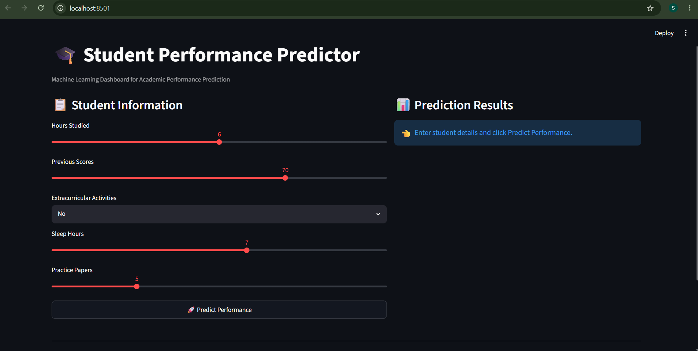
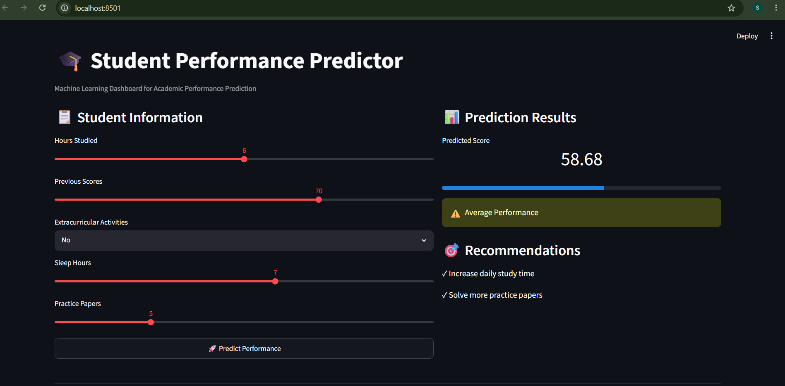

# Student Performance Prediction System

## Overview

This project predicts student academic performance using Machine Learning and provides predictions through an interactive Streamlit dashboard.

## Dataset

Student Performance Dataset

Features:
- Hours Studied
- Previous Scores
- Extracurricular Activities
- Sleep Hours
- Practice Papers

Target:
- Performance Index

## Project Workflow

1. Data Collection
2. Data Cleaning
3. Exploratory Data Analysis
4. Feature Engineering
5. Model Building
6. Model Evaluation
7. Streamlit Deployment

## Model Performance

| Model | R² Score |
|---------|---------|
| Linear Regression | 0.9889 |
| Random Forest | 0.9860 |

Best Model: Linear Regression

## Dashboard Preview

### Home Screen



### Prediction Result



## Technologies Used

- Python
- Pandas
- NumPy
- Scikit-Learn
- Matplotlib
- Seaborn
- Streamlit

## Run Locally

```bash
pip install -r requirements.txt
streamlit run app.py
```

## Author

Smitkumar Rathod